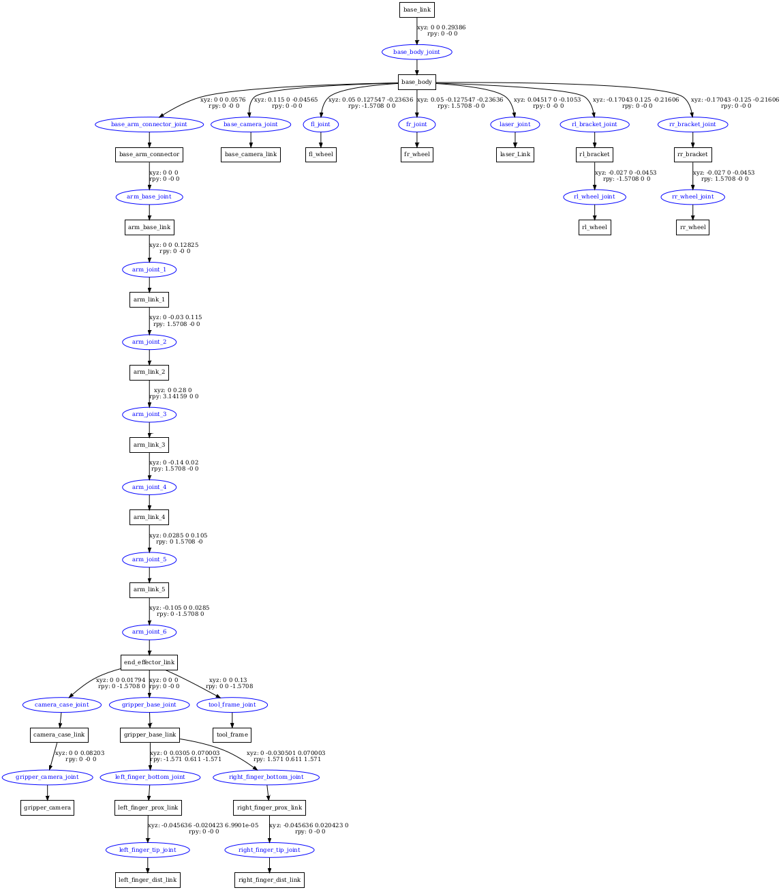

# Robust Holistic Control-Based Trajectory Prediction in Mobile Manipulation System

## Integrated Model
- For some of the existing materials, the dimensions of the materials were different from my robot, so I designed my own


#### How to Use
```bash
mkdir -p hc_ws/src
cd hc_ws/src && git clone https://github.com/j-wye/Holistic_Control.git
cd ../ && colcon build
source install/setup.bash

# View only Manipulator
ros2 launch mobile_manipulator view.launch.py robot_type:=arm

# View only Mobile base
ros2 launch mobile_manipulator view.launch.py robot_type:=base

# View Integrate version with Mobile Base and Manipulator (default is integrate)
ros2 launch mobile_manipulator view.launch.py
```

Following image is integrate version of mobile manipulator




install this first before launch following as:
```bash
sudo apt install -y ros-${ROS_DISTRO}-gazebo-ros2-control*
sudo apt install -y ros-${ROS_DISTRO}-topic-based-ros2-control*
sudo apt install -y ros-${ROS_DISTRO}-picknik-*
sudo apt install -y ros-${ROS_DISTRO}-diff-drive-controller*
sudo apt install -y ros-${ROS_DISTRO}-ros2-control*
```

Want to test integrate model move on a rviz following as:

1. Move Manipulator Arm Joints with command

  - Use Joint Trajectory Controller (Means position control, not a velocity control)
    - ros2 topic pub:
      ```bash
      ros2 topic pub --once --qos-reliability best_effort /joint_trajectory_controller/joint_trajectory trajectory_msgs/msg/JointTrajectory \
      "{\
      joint_names: ['arm_joint_1', 'arm_joint_2', 'arm_joint_3', 'arm_joint_4', 'arm_joint_5', 'arm_joint_6', 'right_finger_bottom_joint'],\
      points: [{\
        positions: [0.0, -1.0, 1.0, 0.5, 0.0, 0.0, 0.8],\
        time_from_start: {sec: 5, nanosec: 0}\
        }]\
      }"
      ```
    - ros2 action send_goal:
      ```bash
      ros2 action send_goal /joint_trajectory_controller/follow_joint_trajectory control_msgs/action/FollowJointTrajectory \
      "{\
        trajectory: {\
          header: {\
            stamp: {\
              sec: 0,\
              nanosec: 0\
            },\
            frame_id: ''\
          },\
          joint_names: ['arm_joint_1', 'arm_joint_2', 'arm_joint_3', 'arm_joint_4', 'arm_joint_5', 'arm_joint_6'],\
          points: [\
            {\
              positions: [0.0, -1.0, 1.0, 0.5, 0.0, 0.0],\
              velocities: [0.0, 0.5, 0.5, 0.5, 0.0, 0.0],\
              time_from_start: {\
                sec: 1.0,\
                nanosec: 0.0\
              }\
            }\
          ]\
        },\
        path_tolerance: [],\
        goal_tolerance: [],\
        goal_time_tolerance: {\
          sec: 1,\
          nanosec: 0\
        }\
      }"
      ```
2. Move Gripper with command:
  - ros2 action send_goal:
    ```bash
    ros2 action send_goal /robotiq_gripper_controller/gripper_cmd control_msgs/action/GripperCommand \
    "{\
      command: {\
        position: 0.8,\
        max_effort: 10.0\
      }\
    }"
```
