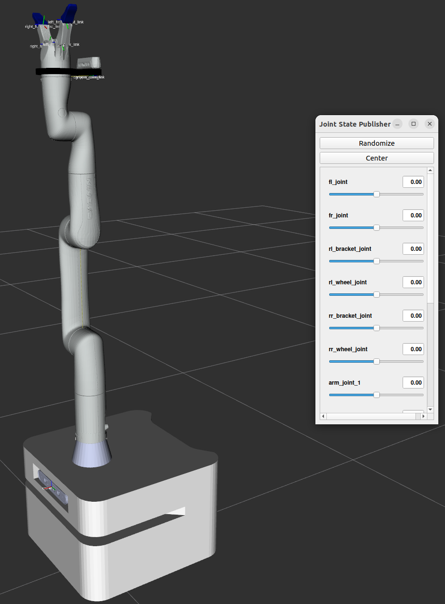

# Robust Holistic Control-Based Trajectory Prediction in Mobile Manipulation System

## Integrated Model
- For some of the existing materials, the dimensions of the materials were different from my robot, so I designed my own


#### How to Use
```bash
mkdir -p hc_ws/src
cd hc_ws/src && git clone https://github.com/j-wye/Holistic_Control.git
cd ../ && colcon build
source install/setup.bash

# View only Manipulator
ros2 launch mobile_manipulator view.launch.py robot_type:=arm

# View only Mobile base
ros2 launch mobile_manipulator view.launch.py robot_type:=base

# View Integrate version with Mobile Base and Manipulator (default is integrate)
ros2 launch mobile_manipulator view.launch.py robot_type:=integrate
```

Following image is integrate version of mobile manipulator



Have to install before launch following as:
```bash
sudo apt install ros-${ROS_DISTRO}-gazebo-ros2-control*
sudo apt install ros-${ROS_DISTRO}-topic-based-ros2-control*
sudo apt install ros-${ROS_DISTRO}-picknik-*
```