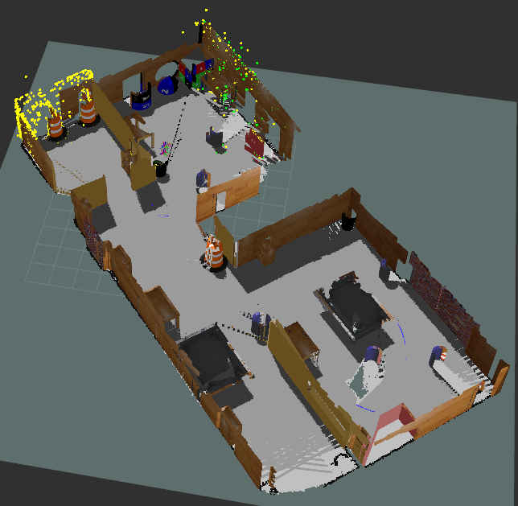
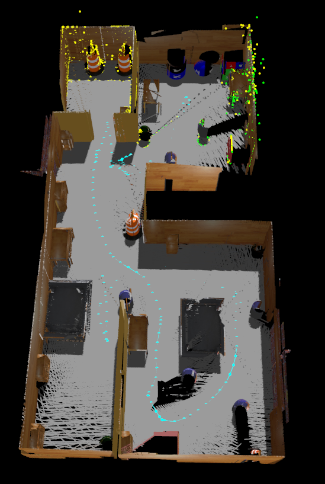

## About RTAB-Map Execution
```bash
ros2 launch rtabmap_launch rtabmap.launch.py\
subscribe_depth:=true\
rgb_topic:=/base_camera_color_sensor/image_raw\
depth_topic:=/base_camera_depth_sensor/depth/image_raw\
camera_info_topic:=/base_camera_color_sensor/camera_info\
frame_id:=base_link\
odom_frame_id:=odom\
use_sim_time:=true\
rviz:=true
```

## How to use
```bash
ros2 launch 
```



